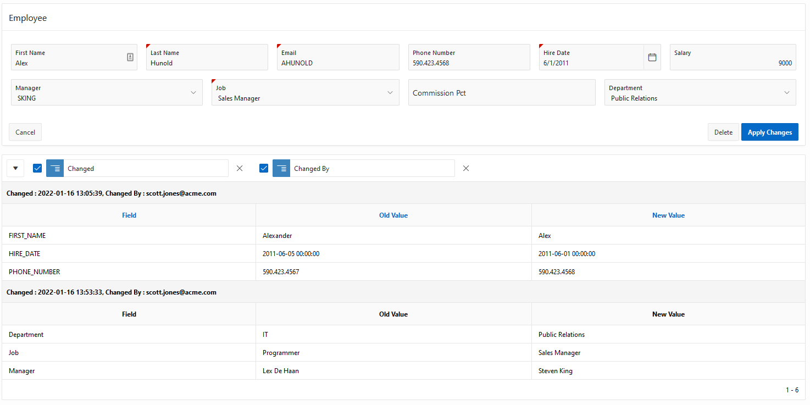
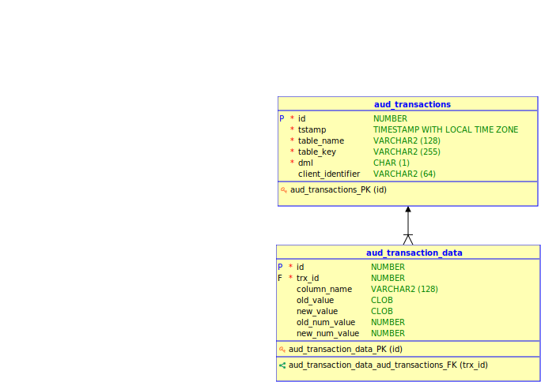
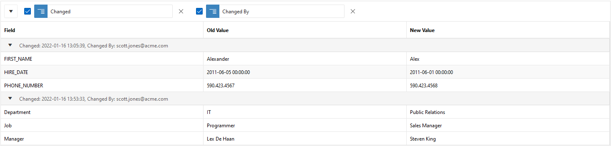

= Oracle DML audit trail
:doctype: article
:encoding: utf-8
:lang: en
:toc: left
:numbered:

== Introduction
This project describes how to capture changes so that they can be displayed in APEX as shown in the screen below:

To get started, you can jump straight to the tutorial.

== How it works
For the tables you want to audit, you will generate a trigger. The trigger captures the changes to the audit tables.

=== Generate trigger

For the well-known EMP table, the generated trigger looks like:

[source,sql]
----
include::trg_aud_emp.sql[]
----

Each change is captured in two central tables: `AUD_TRANSACTIONS` and `AUD_TRANSACTION_DATA`.

=== Create View

To make the audit data more readable for your application, you will manually author a view for each table you are auditing.

The view has the following purposes:

- Translate column names to application column labels
- Translate FK values to functional values
- Translate usernames to natural names

For the EMP table, this view could look like this:

.emp_aud_vw.sql
[source,sql]
----
include::emp_aud_vw.sql[]
----

The view only includes the `UPDATE` changes, because these are all we want to see on the APEX page.

=== Create a Page Region for the Audit View
See the tutorial for a description of these steps.

=== Handling changes to the data model
Any time you change the table definition (add/remove a column) you must re-run the trigger generator. Possibly you may also want to change your view definition.

== Installation Steps

The source for this project can be found on https://github.com/ellipticview/Oracle-DML-audit-trail[github].
To install this package in your APEX project, follow these steps.

Navigate to SQL Workshop > SQL Scripts and perform the following steps:

. Click on *Upload*.
. Choose file `tables.sql`
. Click on Upload
. Click on Run

Repeat for `audit_pkg_pks.sql` and `audit_pkg_pkb.sql`.

Navigate to SQL Workshop > SQL Commands. Copy & paste this script:
----
begin
  audit_pkg.generate_trigger(:table_name);
end;
----

Click on the Save button and enter name 'Create Audit Trigger'. It will now be readily available for future use under *Saved SQL*.

include::tutorial.adoc[leveloffset=+1]

== Design Notes
=== Data Model

The changes for all tables are captured in these two tables:

==== Date and timezone

We want the time to be displayed in the Users local time. There are two components to this:

. Use the `TIMESTAMP WITH LOCAL TIME ZONE` datatype. This stores the timestamp normalized to server time. When users retrieve the data, Oracle Database returns it in the users' local session time zone. See also https://docs.oracle.com/en/database/oracle/oracle-database/21/nlspg/datetime-data-types-and-time-zone-support.html[Database documentation]

. Go to Shared Components > Globalisation > Globalization Attributes. Enable **Automatic Time Zone**. This sets the timezone based on the users browser. See more information in the https://docs.oracle.com/en/database/oracle/application-express/21.2/htmdb/configuring-globalization-attributes.html#GUID-5A46B422-C55E-4ACE-8DF6-0C1A2B6CF924[Apex Documentation]

==== Change Columns
The OLD and NEW values are captured as CLOB and the numeric values are also stored in NUMERIC columns. The numeric columns make it easier and more performant to join with lookup tables.

==== Excluding Audit columns
You will often have Audit columns on the table. These can be excluded from auditing. See the package code.

==== Interactive Report or Interactive Grid
The Interactive Grid has several drawbacks compared to an Interactive Report:

- The headers do not repeat making it less readable
- The rows have equal height making it difficult (impossible?) to handle multiline field values
- There is no easy way to render newlines as new lines.

These steps were performed to create the region shown above:

. Add an Interactive Grid Region
. Title: Changes
. Source > Table Name: `oehr_employees_aud_vw`
. Where-clause: `table_key  = :P3_EMPLOYEE_ID`
. Select column TABLE_KEY and make it type *Hidden Column*
. Select column CHANGED and set the format mask to `YYYY-MM-DD HH24:MI:SS`

Run the report

. Actions > Format > Control Break
. Select columns Changed (Ascending) and Changed By
. Actions > Report > Save

Go back to the Report Designer

. Select the Interactive Grid named *Changes* and click on the Attributes header on the right
. Toolbar: Disable.

== Credits

This design is based on a http://www.laureston.ca/2019/04/28/oracle-dml-change-log/[blogpost] by Michelle Skamene.

It also took inspiration from Connor McDonald's  https://connor-mcdonald.com/2020/08/04/level-up-your-audit-trigger-game/[blog post], with source on https://github.com/connormcd/audit_utility[github].

This site is published from an Asciidoc source using the instructions provided https://ellipticview.github.io/asciidoc-publishing-template/[here].
