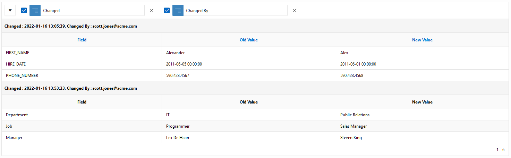

= Tutorial

First follow the installation steps described previously.

== Install demo tables
In APEX, navigate to SQL Workshop > Utilities > Sample Datasets.

Install `HR Data`.
This will install several tables and views, each prefixed by `OEHR_`. We will be basing the example on table `OEHR_EMPLOYEES`.

To make it a little more interesting, we'll add a multi-line Notes field:

----
alter table OEHR_EMPLOYEES add
notes varchar2(2000);
----

== Create the audit trigger

Navigate to SQL Workshop > SQL Commands.

. On the lower half of the screen, select *Saved SQL*.
. Click on *Create Audit Trigger* and click on Run. A prompt appears for the table name
. Enter `OEHR_EMPLOYEES` and click on Submit.

To view the generated trigger:

. navigate to SQL Workshop > Object Browser
. Click on table `OEHR_EMPLOYEES`
. Click on *Triggers* (on the right)
. Click on trigger `TRG_AUD_OEHR_EMPLOYEES`
. Click on *Code*

== Create the view

[source,sql]
----
include::oehr_employees_vw.sql[]
----

== Create Page

=== Create standard Page

In your application:

. select the *Create Page* button
. Choose Form > Report with Form. Click Next.
. Fill out *Report Page name* and **Form Page Name**. Click Next.
. Create a new navigation menu entry
. Datasource: Select table `OEHR_EMPLOYEES`. Click Next.
. Create Form: Select `EMPLOYEE_ID` as the primary key. Press Create.

Let's add LOVs to the 3 foreign keys. Set the Type to `Select List` and List of Values Type as SQL Query with the following SQL:

*JOB_ID*
----
select job_title as display_value
, job_id as return_value
from oehr_jobs
order by 1
----

*MANAGER_ID*
----
select email as display_value
, employee_id as return_value
from oehr_employees
order by 1
----

*DEPARTMENT_ID*
----
select department_name as display_value
, department_id as return_value
from oehr_departments
order by 1
----

We now have the regular Report and Form. We'll now add a region with the audit information.

=== Add Interactive Report

. Add an Interactive Report Region
. Title: Changes
. Source > Table Name: `oehr_employees_aud_vw`
. Where-clause: `table_key  = :P3_EMPLOYEE_ID`
. Select column TABLE_KEY and make it type *Hidden Column*
. Select column CHANGED and set the format mask to `YYYY-MM-DD HH24:MI:SS`
. Select column OLD_VALUE and set the HTML Expression to `<pre style="white-space:pre-wrap">#OLD_VALUE#</pre>`
. Select column NEW_VALUE and set the HTML Expression to `<pre style="white-space:pre-wrap">#NEW_VALUE#</pre>`

NOTE:: the HTML expressions ensure that any newline characters render as a new line.

Run the report

. Actions > Format > Control Break
. Select columns Changed and Changed By
. Actions > Data > Sort
. Select Changed Ascending
. Actions > Report > Save Report
. As Default Report Settings, Primary

Go back to the Report Designer

. Select the Interactive Report named *Changes* and click on the Attributes header on the right
. Search Bar > Include Search Bar: Disable.

